# 🔌 Panduan Integrasi API: SIMRS ⇄ SIMDUDICOM (Produksi)

Dokumen ini menjelaskan alur pengiriman data dua arah antara **SIMRS (Sistem Informasi Manajemen Rumah Sakit)** dan **SIMDUDICOM (Radiology Integration Bridge)** untuk lingkungan **Produksi (Live)**.

Integrasi mendukung dua metode:
1. **Metode REST API** (Menggunakan protokol HTTP JSON - Direkomendasikan untuk sistem modern).
2. **Metode Database Sharing** (Menulis langsung ke tabel database Microsoft SQL Server).

---

## 🗺️ Alur Integrasi Dua Arah

```mermaid
sequenceDiagram
    autonumber
    rect rgb(30, 30, 40)
    Note over SIMRS, SIMDUDICOM: FASE 1: Pengiriman Order (SIMRS ➜ SIMDUDICOM)
    SIMRS->>SIMDUDICOM: POST /api/orders (Data Order & Pasien)
    Note right of SIMDUDICOM: SIMDUDICOM memicu kirim<br/>ServiceRequest ke SATUSEHAT
    end
    
    rect rgb(20, 40, 20)
    Note over Alat/PACS, SIMDUDICOM: FASE 2: Pemeriksaan & Arsip DICOM
    Alat/PACS->>SIMDUDICOM: DICOM C-STORE (Kirim Citra .dcm)
    Note right of SIMDUDICOM: Validasi Accession Number &<br/>Simpan Fisik File DICOM
    SIMDUDICOM->>SIMRS DB: Writeback Metadata Gambar ke tabel `tbl_dicom`
    end
    
    rect rgb(40, 30, 30)
    Note over SIMDUDICOM, SIMRS: FASE 3: Callback Status (SIMDUDICOM ➜ SIMRS)
    Note right of SIMDUDICOM: Setelah sukses upload STOW-RS<br/>atau DiagnosticReport ke SATUSEHAT
    SIMDUDICOM->>SIMRS: Webhook Callback HTTP POST (Status Terintegrasi)
    end
```



---

## 1. Pengiriman Order (SIMRS ➜ SIMDUDICOM)

### A. Metode REST API (HTTP JSON)

SIMRS mendaftarkan order radiologi baru dengan menembak API backend SIMDUDICOM.

#### 🔑 Langkah 1: Mendapatkan Token JWT
Sebelum menembak API, SIMRS wajib melakukan login untuk mendapatkan Bearer Token JWT.

* **Endpoint**: `POST http://<simdudicom-ip>:8026/api/login`
* **Content-Type**: `application/json`
* **Request Payload**:
```json
{
  "username": "admin",
  "password": "admin_radiology_123"
}
```
* **Response Payload (200 OK)**:
```json
{
  "success": true,
  "access_token": "eyJhbGciOiJIUzI1NiIsInR5cCI6IkpXVCJ9...",
  "token_type": "bearer"
}
```

#### 📦 Langkah 2: Mengirim Order Radiologi
Kirim data order pasien ke endpoint orders dengan menyertakan token JWT pada header authorization.

* **Endpoint**: `POST http://<simdudicom-ip>:8026/api/orders`
* **Headers**: 
  * `Authorization: Bearer <access_token_jwt>`
  * `Content-Type: application/json`
* **Request Payload**:
```json
{
  "noradio": "RAD202605280001",
  "rekmed": "0045612",
  "namapas": "BUDI SANTOSO",
  "tgllahir": "1990-05-15",
  "jkel": "1",
  "nadokter": "dr. Ahmad Wijaya, Sp.Rad",
  "tglinput": "2026-05-28T20:40:00"
}
```

| Field | Tipe Data | Deskripsi | Wajib |
| :--- | :--- | :--- | :--- |
| `noradio` | String | Nomor Order Radiologi / Accession Number (Kunci pencocokan modalitas) | Ya |
| `rekmed` | String | Nomor Rekam Medis Pasien | Ya |
| `namapas` | String | Nama Lengkap Pasien | Ya |
| `tgllahir`| String | Tanggal lahir pasien format `YYYY-MM-DD` | Ya |
| `jkel` | String | Jenis Kelamin: `"1"` (Laki-laki) atau `"2"` (Perempuan) | Ya |
| `nadokter`| String | Nama dokter perujuk / pengirim | Tidak (Default: `"Dokter Tidak Diketahui"`) |
| `tglinput`| String | Waktu order dibuat (ISO 8601, contoh: `YYYY-MM-DDTHH:MM:SS`) | Tidak (Default: Waktu sekarang) |

* **Response Payload (201 Created)**:
```json
{
  "success": true,
  "message": "Order radiologi berhasil didaftarkan dan integrasi SATUSEHAT telah dipicu",
  "accession_number": "RAD202605280001"
}
```

---

### B. Metode Database Sharing (Direct SQL Server Write)

Jika SIMRS belum bisa melakukan integrasi REST API, SIMRS cukup mengisikan baris data ke database **artha_medika** di SQL Server milik SIMRS. Mesin poller SIMDUDICOM akan membaca data baru secara periodik (setiap 5 detik).

Lakukan SQL `INSERT` pada tabel `tbl_hradio` dan hubungkan dokter pengirim pada `tbl_dokter`:

```sql
INSERT INTO tbl_hradio (
    noradio,     -- Nomor Order Radiologi (Accession Number)
    rekmed,      -- Nomor Rekam Medis
    namapas,     -- Nama Pasien
    tgllahir,    -- Tanggal Lahir (DATE)
    jkel,        -- Jenis Kelamin ('1' = Laki-laki, '2' = Perempuan)
    drperiksa,   -- Kode Dokter (Dihubungkan ke tbl_dokter.kodokter)
    tglinput     -- Waktu Input (DATETIME)
) VALUES (
    'RAD202605280001',
    '0045612',
    'BUDI SANTOSO',
    '1990-05-15',
    '1',
    'DR001',
    GETDATE()
);
```

---
---

## 2. Pengiriman Hasil Foto & Status (SIMDUDICOM ➜ SIMRS)

Setelah modalitas/alat radiologi selesai melakukan pemotretan dan mengirimkan berkas citra DICOM ke port Storage SCP SIMDUDICOM (`11112`), sistem akan menyimpan berkas citra tersebut dan memberikan status balik ke SIMRS.

### A. Metode Webhook Callback (HTTP POST - Real-time)

SIMDUDICOM akan mengirimkan request `HTTP POST` ke server SIMRS secara otomatis setelah citra selesai diproses atau dikirim ke SATUSEHAT.

* **Endpoint**: Diatur pada variabel `WEBHOOK_URL` di berkas `.env` SIMDUDICOM.
* **Autentikasi**: Mendukung **Basic Auth** (menggunakan `WEBHOOK_USER` dan `WEBHOOK_PASSWORD` di `.env`).
* **Payload JSON (Sukses Upload Citra)**:
```json
{
  "accessionNumber": "RAD202605280001",
  "status": "SUCCESS",
  "message": "ImagingStudy dan 1 file DICOM berhasil dikirim ke SATUSEHAT"
}
```
* **Payload JSON (Gagal Integrasi)**:
```json
{
  "accessionNumber": "RAD202605280001",
  "status": "FAILED",
  "error_code": "STOWRS_PARTIAL_FAILURE",
  "message": "Upload DICOM gagal sebagian: 0 sukses, 1 gagal. Error: HTTP 504 Gateway Timeout"
}
```

* **Payload JSON (Sukses DiagnosticReport / Hasil Bacaan)**:
Setelah dokter menginputkan ekspertise di SIMRS, dan data laporan berhasil terkirim ke SATUSEHAT Kemenkes, webhook akan kembali dipicu:
```json
{
  "accessionNumber": "RAD202605280001",
  "status": "SUCCESS",
  "message": "DiagnosticReport (ID=DR-7789) dan Observation (ID=OB-4412) berhasil dikirim ke SATUSEHAT"
}
```

---

### B. Metode Database Writeback (Tabel `tbl_dicom` di SIMRS)

Saat SIMDUDICOM menerima berkas gambar DICOM dari mesin (CR/CT/MRI/USG), sistem akan menulis data detail file citra radiologi secara otomatis ke tabel `tbl_dicom` di database SIMRS Anda. 

SIMRS dapat menampilkan hasil foto atau me-load WADO URL dari tabel ini.

**Struktur Data yang Ditulis ke `tbl_dicom`**:

| Kolom | Tipe Data | Deskripsi |
| :--- | :--- | :--- |
| `noradio` | NVARCHAR | Accession Number (untuk join ke `tbl_hradio`) |
| `studyuid` | NVARCHAR | Study Instance UID unik dari pemeriksaan radiologi |
| `seriesuid`| NVARCHAR | Series Instance UID unik |
| `sopuid` | NVARCHAR | SOP Instance UID unik per file citra/gambar |
| `filepath` | NVARCHAR | Path penyimpanan lokal citra DICOM pada server SIMDUDICOM |
| `wadourl` | NVARCHAR | URL pemanggilan WADO resmi SATUSEHAT Kemenkes |
| `tglinput` | DATETIME | Waktu citra diarsipkan ke database |

SIMRS dapat me-render gambar dengan memanggil **WADO URL** tersebut di PACS viewer internal Anda atau menggunakan penampil web CornerstoneJS terintegrasi.

* **Format Link WADO Produksi**:
  `https://api.kemkes.go.id/dicom-web/wado?requestType=WADO&studyUID={studyuid}&seriesUID={seriesuid}&objectUID={sopuid}`
