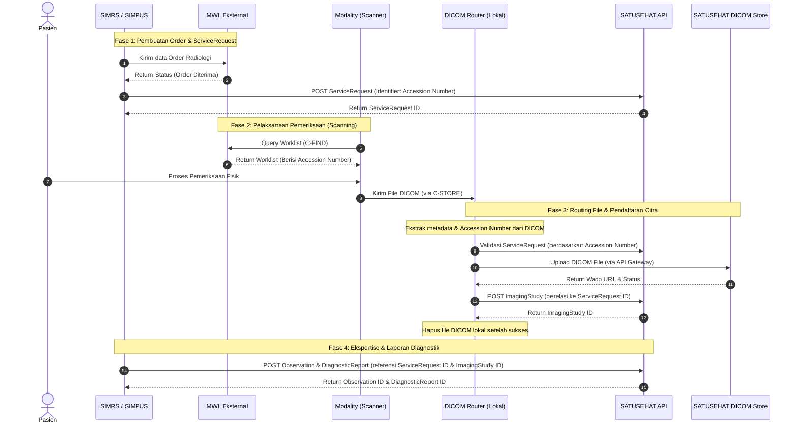

# Integrasi DICOM Router SATUSEHAT (Alur MWL di Luar DICOM Router)

Dokumentasi ini menjelaskan arsitektur, alur kerja (workflow), peran komponen, serta langkah-langkah implementasi integrasi PACS/Modality ke **SATUSEHAT Platform** menggunakan **DICOM Router** dengan **Modality Worklist (MWL) eksternal** (di luar DICOM Router).

---

## 📌 Arsitektur & Peran Komponen

Dalam alur ini, **DICOM Router** berfungsi murni sebagai jembatan pengiriman file DICOM dan pembuatan resource `ImagingStudy` ke SATUSEHAT, sementara daftar kerja modality (Modality Worklist) dikelola oleh sistem eksternal (misal: RIS/PACS lokal atau Server MWL Mandiri).

### Komponen yang Terlibat:
1. **SIMRS / SIMPUS**: Sistem Informasi Manajemen Rumah Sakit / Puskesmas. Bertindak sebagai inisiator order, pendaftar `ServiceRequest`, serta pengirim laporan keahlian (`DiagnosticReport` & `Observation`).
2. **Modality Worklist (MWL) Eksternal**: Server worklist lokal yang menerima order dari SIMRS dan menyediakan daftar kerja (worklist) untuk dicari oleh perangkat radiologi (Modality).
3. **Modality (Scanner Device)**: Alat pemindai (seperti X-Ray, CT-Scan, MRI, USG) yang mengambil data pasien dari MWL, melakukan scanning, dan mengirimkan file DICOM hasil pemeriksaan.
4. **DICOM Router**: Layanan backend dari Kementerian Kesehatan yang diinstal di lokal Fasyankes untuk mendengarkan C-STORE dari Modality, mengunggah DICOM ke DICOM Store SATUSEHAT, dan mendaftarkan `ImagingStudy`.
5. **SATUSEHAT Platform**: Platform integrasi kesehatan nasional yang menyimpan metadata FHIR (`ServiceRequest`, `ImagingStudy`, `DiagnosticReport`, `Observation`).
6. **SATUSEHAT DICOM Store**: Penyimpanan cloud khusus untuk file citra medis DICOM yang dikelola oleh Kemenkes.

---

## 🔄 Diagram Alur Kerja (Workflow)

Berikut adalah visualisasi urutan interaksi antar sistem dalam alur kerja menggunakan MWL di luar DICOM Router:

---

## 📝 Detail Penjelasan Langkah demi Langkah

### **Fase 1: Pembuatan Order & ServiceRequest**
1. **Langkah 1-2**: Dokter membuat permintaan pemeriksaan radiologi di **SIMRS**. SIMRS mengirimkan data order tersebut ke sistem **MWL Eksternal** agar dapat diakses oleh Modality. MWL mengembalikan status sukses penerimaan order.
2. **Langkah 3-4**: **SIMRS** membuat resource **ServiceRequest** ke **SATUSEHAT** dengan menyertakan **Accession Number** yang unik sebagai identifier utama pemeriksaan tersebut.
3. **Langkah 5-6**: **SATUSEHAT** memproses data dan mengembalikan **ServiceRequest ID** ke **SIMRS**. ID ini wajib disimpan oleh SIMRS untuk referensi di langkah akhir.

### **Fase 2: Pelaksanaan Pemeriksaan (Scanning)**
4. **Langkah 7-8**: Petugas radiologi di **Modality** melakukan pencarian daftar kerja pasien (C-FIND Query) ke **MWL Eksternal**. MWL mengirimkan data pasien lengkap beserta **Accession Number** ke Modality.
5. **Langkah 9-10**: Modality melakukan scanning pada pasien, lalu menyimpan gambar medis tersebut ke dalam format DICOM. Modality secara otomatis mengirimkan file DICOM tersebut ke **DICOM Router** lokal melalui protokol standard **C-STORE**.

### **Fase 3: Routing File & Pendaftaran Citra**
6. **Ekstraksi Internal**: **DICOM Router** menerima file, mengekstrak metadata dari header file DICOM, dan mencocokkan **Accession Number** yang tertera di dalam file DICOM dengan resource **ServiceRequest** yang ada di **SATUSEHAT**.
7. **Langkah 11-12**: **DICOM Router** mengirimkan file DICOM ke **SATUSEHAT DICOM Store** (melalui API Gateway Kemenkes).
8. **Langkah 13-14**: **SATUSEHAT DICOM Store** menyimpan file tersebut dan mengembalikan **Wado URL** (alamat akses gambar) ke DICOM Router.
9. **Langkah 15-16**: **DICOM Router** membuat resource **ImagingStudy** di **SATUSEHAT** yang berelasi dengan `ServiceRequest` yang dibuat pada Langkah 3 (`basedOn` -> `ServiceRequest ID`).
10. **Langkah 17-18**: **SATUSEHAT** mengembalikan **ImagingStudy ID** ke DICOM Router. Setelah dikonfirmasi sukses, DICOM Router menghapus salinan file DICOM di penyimpanan lokal/sementara untuk efisiensi disk space.

### **Fase 4: Ekspertise & Laporan Diagnostik**
11. **Langkah 19-20**: Setelah dokter spesialis radiologi mengisi bacaan hasil pemeriksaan (ekspertise) di **SIMRS**, SIMRS mengirimkan data hasil berupa resource **Observation** dan **DiagnosticReport** ke **SATUSEHAT** dengan mereferensikan **ServiceRequest ID** dan **ImagingStudy ID**. SATUSEHAT mengembalikan ID dari kedua resource tersebut dan proses dinyatakan selesai secara penuh.

---

## 🔑 Kunci Keberhasilan Integrasi (Crucial Rules)

> [!IMPORTANT]
> **Konsistensi Accession Number (Tag DICOM `0008,0050`)**
> 
> Keberhasilan alur ini sangat bergantung pada konsistensi nilai **Accession Number** yang dibuat oleh SIMRS. Nilai ini harus:
> 1. Unik di tingkat Fasyankes untuk setiap order pemeriksaan.
> 2. Dikirimkan dengan tepat dari **SIMRS ke MWL**.
> 3. Disematkan dengan benar oleh **MWL ke Modality** sehingga tertulis di header file DICOM hasil scan pada tag `(0008,0050)`.
> 4. Dikirimkan sebagai `identifier` bernilai unik saat **SIMRS membuat ServiceRequest** ke SATUSEHAT.
> 
> Jika terdapat perbedaan karakter sekecil apa pun pada Accession Number di file DICOM atau ServiceRequest, DICOM Router akan gagal melakukan pencocokan, sehingga proses upload dan pembuatan `ImagingStudy` akan terhenti (gagal).

---

## 📂 Pemetaan Resource FHIR Terkait

| Nama Resource | Dikirim Oleh | Parameter Penting | Referensi Utama |
| :--- | :--- | :--- | :--- |
| **`ServiceRequest`** | SIMRS | `identifier` (Accession Number) | `subject` (Patient ID), `requester` (Practitioner/Organization) |
| **`ImagingStudy`** | DICOM Router | `started` (Waktu scan), `series` (Detail citra), `endpoint` (Wado URL) | `basedOn` (ServiceRequest ID), `subject` (Patient ID) |
| **`Observation`** | SIMRS | `code` (LOINC Code Pemeriksaan), `valueString` (Hasil observasi) | `partOf` (ImagingStudy ID), `subject` (Patient ID) |
| **`DiagnosticReport`** | SIMRS | `conclusion` (Kesimpulan klinis), `presentedForm` (PDF Hasil jika ada) | `basedOn` (ServiceRequest ID), `result` (Observation ID), `imagingStudy` (ImagingStudy ID) |

---

> [!TIP]
> Dokumen panduan resmi pengiriman data radiologi dan instalasi dapat diunduh langsung melalui tautan resmi yang disediakan oleh Portal Dokumentasi SATUSEHAT Kementerian Kesehatan Republik Indonesia.
