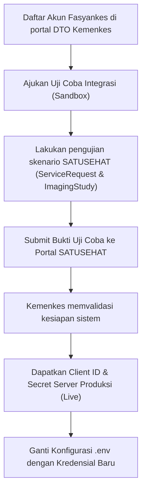

# 🚀 Panduan Deployment Produksi (Go-Live) — SIMDUDICOM

Dokumen ini berisi panduan langkah demi langkah untuk menstandardisasi sistem **Radiology Integration Bridge (SIMDUDICOM)** agar layak digunakan di lingkungan produksi rumah sakit/klinik (Live), aman dari celah keamanan, dan sesuai dengan regulasi Kemenkes (SATUSEHAT).

---

## 📋 Daftar Periksa (Checklist) Keamanan & Produksi

Gunakan daftar periksa di bawah ini untuk melacak status kesiapan sistem sebelum go-live:

- [ ] **Langkah 1**: Matikan backdoor autentikasi (JWT Bypass) di Backend API.
- [ ] **Langkah 2**: Ubah `JWT_SECRET` di `.env` dengan kunci rahasia produksi.
- [ ] **Langkah 3**: Konfigurasikan sertifikat SSL (HTTPS) pada NGINX.
- [ ] **Langkah 4**: Amankan jaringan koneksi Database SIMRS (VPN / IP Whitelisting).
- [ ] **Langkah 5**: Batasi akses DICOM SCP (IP Whitelist modalitas).
- [ ] **Langkah 6**: Terapkan kredensial resmi SATUSEHAT Produksi Kemenkes.
- [ ] **Langkah 7**: Jadwalkan backup database otomatis menggunakan Windows Task Scheduler / Cron.
- [ ] **Langkah 8**: Konfigurasikan endpoint SATUSEHAT DICOMweb (`SATUSEHAT_DICOM_BASE_URL` & `SATUSEHAT_AUTH_URL`) sesuai sandbox/production.
- [ ] **Langkah 9**: Tentukan `SATUSEHAT_ORGANIZATION_ID` resmi rumah sakit.
- [ ] **Langkah 10**: Konfigurasikan Webhook Callback SIMRS (`WEBHOOK_URL`, `WEBHOOK_USER`, `WEBHOOK_PASSWORD`) untuk update status otomatis ke SIMRS.


---

> [!WARNING]
> **Data Medis Pasien Sangat Sensitif**
> Membiarkan sistem berjalan dengan konfigurasi HTTP biasa tanpa autentikasi JWT di lingkungan aktif melanggar undang-undang Perlindungan Data Pribadi (UU PDP). Pastikan seluruh langkah pengamanan di bawah ini diselesaikan.

---

## 💾 Arsitektur & Kebutuhan Database

Sistem jembatan integrasi ini bekerja secara hybrid menggunakan arsitektur dual-database:

### 1. Database SIMRS Utama (Eksternal / Milik Rumah Sakit)
* **Jenis Database**: Microsoft SQL Server
* **Lokasi Host**: Jaringan rumah sakit (`103.167.236.130` atau IP lokal rumah sakit)
* **Status**: Sudah harus ada dan berjalan secara independen.
* **Kegunaan**: 
  * Sumber data penarikan order pemeriksaan radiologi baru (membaca tabel `tbl_hradio` & `tbl_dokter`).
  * Tempat penulisan kembali (*writeback*) status citra DICOM yang berhasil disimpan (ke tabel `tbl_dicom`).

### 2. Database Jembatan Lokal (Internal / Kontainer Docker)
* **Jenis Database**: Microsoft SQL Server 2019
* **Lokasi Host**: Berjalan otomatis di dalam kontainer Docker (`simdudicom-bridge-db-1`)
* **Status**: **Otomatis dibuat** saat kontainer dijalankan. Tidak perlu instalasi manual.
* **Kegunaan**:
  * Penyimpanan data order lokal sementara untuk pencocokan.
  * Pembuatan otomatis *Accession Number* unik jika dikirimkan kosong dari SIMRS.
  * Log audit integrasi SATUSEHAT dan pelacakan antrean upload data.
  * Inisialisasi skema tabel otomatis menggunakan berkas [database/init.sql](file:///d:/SIMDUDICOM/database/init.sql).

### 3. Database In-Memory Redis (Internal / Kontainer Docker)
* **Jenis Database**: Redis Alpine
* **Lokasi Host**: Berjalan otomatis di dalam kontainer Docker (`simdudicom-redis-1`)
* **Status**: **Otomatis dibuat** saat kontainer dijalankan.
* **Kegunaan**:
  * Mengelola antrean (*task queue*) Celery asinkron untuk pengiriman FHIR ke SATUSEHAT.
  * Hasil eksekusi tugas (*result backend*) dengan fitur automatic retry backoff.

---

## 🛠️ Langkah Demi Langkah Pembaruan

### Langkah 1: Hapus JWT Bypass di Backend API
Secara default, demi kemudahan pengujian lokal, backend membiarkan permintaan masuk tanpa token JWT. Untuk lingkungan produksi, ubah baris kode di berkas [backend/app/main.py](file:///d:/SIMDUDICOM/backend/app/main.py#L33-L52) sebagai berikut:

```diff
def get_current_user(credentials: HTTPAuthorizationCredentials = Depends(security_scheme)):
    """
    Dependency untuk memverifikasi JWT Token pada request header.
    Jika token tidak valid, kembalikan HTTP 401 Unauthorized.
    """
-   # Membiarkan akses tanpa token untuk kemudahan testing jika JWT_SECRET dummy
-   # Namun di production, verifikasi ini wajib aktif.
-   if not credentials:
-       # Jika tidak ada token, izinkan demi kemudahan demo lokal, namun catat di log
-       return {"username": "anonymous_test"}
-       
+   if not credentials:
+       raise HTTPException(
+           status_code=status.HTTP_401_UNAUTHORIZED,
+           detail="Token otentikasi diperlukan untuk mengakses resource ini",
+           headers={"WWW-Authenticate": "Bearer"},
+       )
+       
    token = credentials.credentials
    payload = decode_access_token(token)
```

---

### Langkah 2: Ubah Kunci JWT dan Kredensial Produksi di `.env`
Ganti nilai default di berkas `.env` dengan kredensial yang aman dan valid:

1. Buat kunci rahasia baru untuk `JWT_SECRET` (bisa digenerate via PowerShell: `[Convert]::ToBase64String((1..32 | % { [byte](Get-Random -Minimum 0 -Maximum 256) }))`).
2. Ganti URL SATUSEHAT ke server Production dan masukkan Client ID/Secret resmi dari Kemenkes.

```ini
# /d:/SIMDUDICOM/.env

# Kunci Keamanan JWT (Ganti dengan string rahasia yang acak dan kuat!)
JWT_SECRET=Masukan_Kunci_Rahasia_Unik_Dan_Panjang_Disini

# SATUSEHAT Platform Kredensial Produksi (Live)
SATUSEHAT_BASE_URL=https://api.kemkes.go.id/fhir-r4/v1
SATUSEHAT_CLIENT_ID=client_id_produksi_dari_kemenkes
SATUSEHAT_CLIENT_SECRET=client_secret_produksi_dari_kemenkes
```

---

### Langkah 3: Konfigurasi SSL/HTTPS di NGINX
Ubah pemetaan port NGINX di `docker-compose.yml` agar menerima trafik HTTPS (Port 443) dan pasang volume sertifikat SSL SSL Anda.

#### 1. Edit [docker-compose.yml](file:///d:/SIMDUDICOM/docker-compose.yml):
```yaml
  nginx:
    build:
      context: ./nginx
    ports:
      - "8026:8026"   # Tetap buka untuk redirect ke HTTPS jika perlu
      - "443:443"     # Port HTTPS Produksi
      - "104:104"
      - "11112:11112"
    volumes:
      - ./frontend:/usr/share/nginx/html
      - ./nginx/ssl:/etc/nginx/ssl:ro   # Mount folder sertifikat SSL
```

#### 2. Edit [nginx.conf](file:///d:/SIMDUDICOM/nginx/nginx.conf) di Server Block HTTP:
```nginx
    server {
        listen 443 ssl;
        server_name radiology-bridge.hospital-domain.com;

        # Path Sertifikat SSL
        ssl_certificate /etc/nginx/ssl/live/hospital-domain.com/fullchain.pem;
        ssl_certificate_key /etc/nginx/ssl/live/hospital-domain.com/privkey.pem;
        
        # SSL Protocols & Ciphers rekomendasi keamanan
        ssl_protocols TLSv1.2 TLSv1.3;
        ssl_ciphers HIGH:!aNULL:!MD5;

        location / {
            root /usr/share/nginx/html;
            index index.html login.html;
            try_files $uri $uri/ /index.html;
        }
        
        location /api/ {
            proxy_pass http://backend_api;
            proxy_set_header Host $host;
            proxy_set_header X-Real-IP $remote_addr;
            proxy_set_header X-Forwarded-Proto https; # Beritahu FastAPI trafik berupa https
        }
    }
```

---

### Langkah 4: Amankan Koneksi Database SIMRS
Karena database SIMRS Anda berada di host `103.167.236.130` yang terhubung ke internet, amankan jalur koneksi data agar tidak bisa disadap:

1. **VPN Site-to-Site**: Pasang VPN khusus (misal: OpenVPN, IPSec, atau WireGuard) antara server jembatan Docker dengan jaringan tempat server database SIMRS berada. Jika menggunakan VPN, ubah host database di `.env` menjadi IP private VPN (misal: `10.8.0.x`).
2. **Firewall Whitelisting**: Pada server database SIMRS (`103.167.236.130`), buat aturan *Inbound* firewall yang hanya membolehkan Port `1433` diakses dari IP Publik statis server jembatan Docker Anda. Tolak seluruh koneksi dari IP publik lainnya.

---

### Langkah 5: Keamanan Akses DICOM (IP Whitelist)
Modality Worklist (port 104) dan C-STORE Receiver (port 11112) secara default akan merespons koneksi dari IP mana pun. Batasi koneksi masuk pada port tersebut di tingkat host OS menggunakan **Windows Defender Firewall** (jika di-deploy di Windows) atau **UFW / iptables** (jika di-deploy di Linux):

* Hanya izinkan Port `104` dan `11112` diakses oleh IP dari modalitas radiologi rumah sakit (misalnya: IP mesin X-Ray `192.168.10.50`, IP CT-Scan `192.168.10.51`).

---

### Langkah 6: Otomatisasi Backup Harian (Cron / Task Scheduler)
Pastikan skrip backup database lokal bridge `database/backup.sh` berjalan setiap hari untuk mencegah kehilangan log integrasi SATUSEHAT.

#### Jika Deploy di Host Windows:
Buat task terjadwal menggunakan **Windows Task Scheduler**:
1. Buka *Task Scheduler* -> *Create Basic Task*.
2. Trigger: *Daily* (Setiap jam 01.00 malam).
3. Action: *Start a program*.
4. Program/script: `powershell.exe`
5. Add arguments: `-File D:\SIMDUDICOM\database\backup_trigger.ps1` (atau buat pemanggil `.bat` yang menjalankan perintah `docker exec -t simdudicom-bridge-db-1 /bin/bash /backup.sh`).

---

## 🏥 Kepatuhan Regulasi Kemenkes (Panduan Pengiriman Radiologi)

SIMDUDICOM telah dioptimalkan agar memenuhi **Panduan Pengiriman Data Radiologi ke SATUSEHAT** yang dirilis oleh DTO Kemenkes. Berikut adalah detail implementasi kepatuhan yang harus dipahami oleh tim IT Rumah Sakit:

### 1. Validasi Accession Number (ACSN) di DICOM Receiver
* **Aturan Kemenkes (Hal. 22)**: File DICOM yang dikirim dari modalitas wajib memiliki *Accession Number* yang valid dan telah didaftarkan terlebih dahulu di database melalui order/ServiceRequest. Jika kosong atau tidak dikenal, router harus langsung menolak (*Fail/Reject*).
* **Solusi SIMDUDICOM**:
  * Penerima DICOM (`Storage SCP`) membaca tag `(0008,0050)`.
  * Melakukan trim pada karakter kosong/spasi.
  * Mencocokkan nilai tersebut dengan tabel `radiology_orders` di database lokal bridge.
  * Jika **kosong** atau **tidak terdaftar**, transmisi C-STORE langsung ditolak dengan mengembalikan status code `0xA700` (Refused: Out of Resources). Hal ini menghentikan pemrosesan gambar ilegal di tingkat protokol DICOM.

### 2. Upload File DICOM Fisik via STOW-RS
* **Aturan Kemenkes (Hal. 20, Langkah 5)**: Gambar radiologi fisik (.dcm) harus diunggah ke DICOMweb gateway SATUSEHAT menggunakan standar **STOW-RS** (Store Over Webby REST Services) setelah data `ImagingStudy` terdaftar di FHIR server.
* **Solusi SIMDUDICOM**:
  * Client mengunggah file `.dcm` menggunakan request `HTTP POST` multipart/related ke `{SATUSEHAT_DICOM_BASE_URL}/dicom/v1/dicomWeb/studies`.
  * Setiap berkas wajib menyertakan header `"X-ImagingStudy-ID"` yang bernilai ID resource `ImagingStudy` yang didapatkan dari SATUSEHAT.
  * Timeout default diatur sebesar **120 detik** untuk mencegah kegagalan unggahan pada berkas citra beresolusi tinggi (seperti CT/MRI).

### 3. Webhook Callback Notifikasi ke SIMRS
* **Aturan Kemenkes (Hal. 8-9)**: Sistem integrasi wajib memberikan laporan balik status pengiriman data radiologi ke SIMRS secara real-time.
* **Solusi SIMDUDICOM**:
  * Modul `webhook.py` mengirimkan `HTTP POST` dengan format payload JSON berikut:
    ```json
    {
      "accessionNumber": "ACSN-123456",
      "status": "SUCCESS" // atau "FAILED"
    }
    ```
  * Jika status `"FAILED"`, payload akan dilengkapi dengan `error_code` (misal: `"STOWRS_PARTIAL_FAILURE"`) dan pesan penjelasan `"message"`.
  * Dilengkapi dengan autentikasi keamanan **Basic Auth** (`WEBHOOK_USER` dan `WEBHOOK_PASSWORD`) dan mekanisme *retry* otomatis sebanyak **3 kali** jika SIMRS lambat merespons (> 5 detik).

### 4. Thread-Safe Token Caching
* **Peningkatan Kinerja**: Untuk menghemat kuota request token ke OAuth2 SATUSEHAT (yang berumur 50 menit), SIMDUDICOM menggunakan caching token.
* **Keamanan Konkurensi**: Karena Celery workers memproses antrean secara paralel, client dilengkapi dengan thread lock (`threading.Lock()`) dengan mekanisme *double-checked locking* saat memperbarui token. Ini menjamin request token baru tidak dikirim ganda oleh thread yang berbeda secara bersamaan.

---

## 📢 Prosedur Pendaftaran SATUSEHAT Produksi

Untuk beralih dari lingkungan uji coba (Sandbox) ke lingkungan produksi resmi, pihak Rumah Sakit / Klinik harus menempuh langkah berikut:



1. **Pendaftaran**: Kunjungi [Portal SATUSEHAT Kemenkes](https://satusehat.kemkes.go.id/platform) untuk membuat akun Fasyankes resmi.
2. **Kredensial Produksi**: Masukkan Kredensial Produksi baru ke berkas `.env` beserta `ORGANIZATION_ID` resmi rumah sakit Anda.
3. **Restart Service**: Jalankan restart container untuk memuat konfigurasi produksi:
   ```bash
   docker compose down; docker compose up -d
   ```
